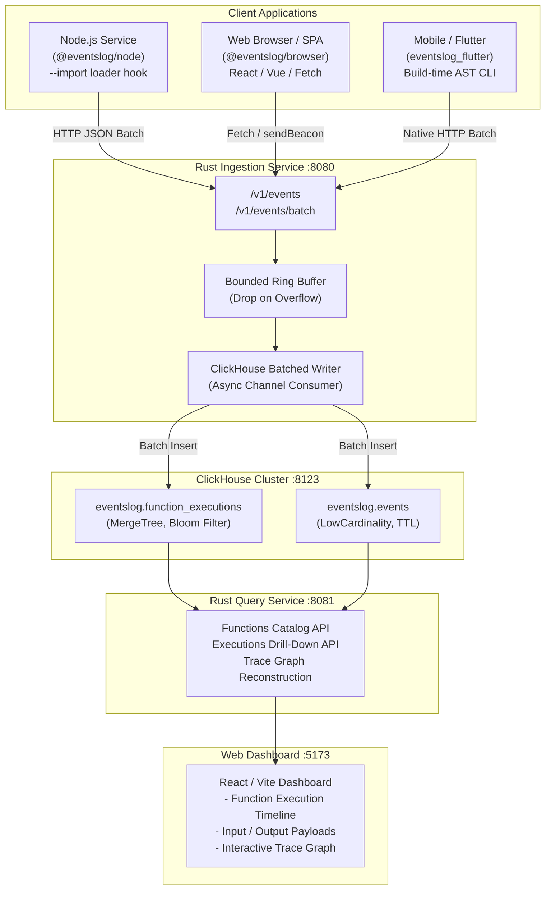

# EventsLog

<div align="center">

**Enterprise Zero-Code Function Observability & Distributed Tracing Platform**

Observe application functions, execution trees, inputs, outputs, errors, and performance metrics across multi-language microservices, frontends, and mobile apps — without modifying a single line of business code.

[](LICENSE)
[](https://www.rust-lang.org/)
[](https://nodejs.org/)
[](https://flutter.dev/)
[](https://clickhouse.com/)

[Overview](#1-overview) •
[Architecture](#2-platform-architecture) •
[Local Mode (Zero Server)](#3-local-mode-zero-server-zero-docker) •
[SDKs & Zero-Code](#4-client-sdks--zero-code-mechanisms) •
[Configuration](#5-declarative-configuration) •
[Quickstart](#6-quickstart-guide) •
[Verification](#7-testing--verification) •
[Repository Layout](#8-repository-layout)

</div>

---

## 1. Overview

Traditional observability tools (APMs and logging frameworks) force engineering teams to choose between two painful trade-offs:
1. **High-Level APM Spans**: Only capture coarse HTTP/database boundaries, leaving internal business logic and helper functions as opaque black boxes.
2. **Manual Logging**: Requires developers to litter `logger.info(...)` statements across business logic, create boilerplate wrappers, and perpetually maintain log formatting — leaking telemetry concerns into domain code.

**EventsLog eliminates this friction with Zero-Code Function Observability.**

Instead of writing log lines or manual decorators, developers declare which functions, classes, or modules they want to observe in a simple `eventslog.yaml` configuration file. EventsLog automatically instruments the application runtime, capturing:

- **Function Identity**: Module name, class name, method name, source file path, and line numbers.
- **Inputs & Outputs**: Serialized invocation parameters and return values (with automated privacy masking).
- **Execution Lifecycle**: Nanosecond-accurate execution duration, status (`success` or `error`), and uncaught exceptions with complete stack traces.
- **Trace Hierarchy**: Automatic caller-callee causality trees propagated seamlessly across asynchronous boundaries (`AsyncLocalStorage` in Node, `Zone` in Dart, distributed headers across HTTP).
- **Fail-Safe & Non-Intrusive**: Observability failures will **never** block or crash the host application. If ingestion or ClickHouse is temporarily unavailable, events are dropped safely via bounded ring buffers without memory leaks.

```text
    ┌─────────────────────────────────────────────────────────────┐
    │              Business Code (100% Unchanged)                 │
    │        OrderService.createOrder() ──► PaymentService.pay()  │
    └──────────────────────────────┬──────────────────────────────┘
                                   │
                                   ▼
    ┌─────────────────────────────────────────────────────────────┐
    │          EventsLog Declarative Configuration                │
    │      Include: "*Service.*", Sanitize: ["cardNumber", ...]   │
    └──────────────────────────────┬──────────────────────────────┘
                                   │
                                   ▼
    ┌─────────────────────────────────────────────────────────────┐
    │       Zero-Code Instrumentation (Loader Hook / AST CLI)     │
    │   Node.js (AsyncLocalStorage)  │  Browser  │  Flutter/Dart  │
    └──────────────────────────────┬──────────────────────────────┘
                                   │  Batch Transport (HTTP / Beacon)
                                   ▼
    ┌─────────────────────────────────────────────────────────────┐
    │          High-Throughput Rust Ingestion Service             │
    │        Axum HTTP Server ──► Memory Ring Buffer (100k)       │
    └──────────────────────────────┬──────────────────────────────┘
                                   │  Batched Micro-Inserts
                                   ▼
    ┌─────────────────────────────────────────────────────────────┐
    │        ClickHouse Columnar Storage (MergeTree Engine)       │
    │    Bloom Filter Indices ──► Monthly Partitions ──► TTL      │
    └──────────────────────────────┬──────────────────────────────┘
                                   │
                                   ▼
    ┌─────────────────────────────────────────────────────────────┐
    │        Rust Query API Service & React Web Dashboard         │
    │      Function Catalog ──► Execution Drilldown ──► Traces    │
    └─────────────────────────────────────────────────────────────┘
```

---

## 2. Platform Architecture

EventsLog is architected as a high-performance monorepo separating client runtime SDKs, high-throughput Rust backend services, ClickHouse analytical storage, and an interactive React web dashboard.



### Architectural Subsystems

| Subsystem | Technology | Location | Description |
| :--- | :--- | :--- | :--- |
| **Rust Crates** | Rust 1.80+ | `crates/` | Shared domain models: `protocol` (canonical types), `schema` (storage records), `config` (server configs), and `common` (logging/metrics). |
| **Ingestion Service** | Rust / Axum / Tokio | `services/ingestion` | High-throughput HTTP ingestion pipeline with lock-free memory ring buffer and batched ClickHouse writer. |
| **Query Service** | Rust / Axum / Tokio | `services/query` | Analytical query API computing function statistics, execution histories, and cross-service distributed trace graphs. |
| **Platform API** | Rust / Axum | `services/api` | Administrative control plane for projects, environments, and API access keys. |
| **Storage Layer** | ClickHouse 23+ | `storage/clickhouse` | Columnar database schema, Bloom filter indices on trace IDs, partitioning by month, and 30-day TTL data retention. |
| **Local Service** | Rust / Axum / rusqlite | `services/local` | Lightweight single-binary local service embedding SQLite with WAL mode, offering both Ingestion and Query APIs for zero-docker environments. |
| **Web Dashboard** | React 18 / TypeScript / Vite | `dashboard/` | Modern user interface for function catalog search, execution detail inspection, and visual trace hierarchy tree navigation. |

---

## 3. Local Mode: Zero-Server, Zero-Docker Observability

In addition to enterprise-scale distributed ClickHouse deployment, EventsLog supports **Full Local Storage Mode (本地模式)**:
- **Zero External Servers**: No Docker containers, no ClickHouse instances, and no background daemons required.
- **Immediate Developer Onboarding**: External projects that only install the SDK can immediately observe and debug function executions out-of-the-box.

```text
┌────────────────────────────────────────────────────────────────────────┐
│                   EventsLog Local Storage Architecture                 │
├──────────────────────────────────┬─────────────────────────────────────┤
│      Browser Client (Web/SPA)    │     Node.js / Desktop / Backend     │
│       (@eventslog/browser)       │          (@eventslog/node)          │
├──────────────────────────────────┼─────────────────────────────────────┤
│         Browser Engine           │           In-Process Engine         │
│          IndexedDB               │        SQLite (node:sqlite WAL)     │
│         (eventslog_db)           │             (./eventslog.db)        │
├──────────────────────────────────┴─────────────────────────────────────┤
│                 Web Dashboard & Embedded DevTools                      │
│   • Topbar Data Source Switch: [Remote Cluster] [Local SQLite] [IndexedDB]
│   • In-Browser Floating DevTools Drawer (devtools: true)               │
│   • Standalone Rust Local Service binary (`cargo run -p eventslog-local`)│
└────────────────────────────────────────────────────────────────────────┘
```

### 3.1 Node.js In-Process SQLite Mode
Install only `@eventslog/node` into your existing project:
```bash
npm install @eventslog/node
```
Run your application in local mode — EventsLog automatically initializes `./eventslog.db` with WAL mode and records all function executions, durations, arguments, and traces:
```bash
# Via environment variable (Zero-Code)
EVENTSLOG_MODE=local node -r @eventslog/node/register dist/index.js

# Or with custom SQLite file path
EVENTSLOG_MODE=local EVENTSLOG_SQLITE_PATH=./my-debug.db node -r @eventslog/node/register dist/index.js
```

### 3.2 Browser In-Browser IndexedDB Mode & Embedded DevTools
Install `@eventslog/browser` in your React/Vue/SPA app:
```bash
npm install @eventslog/browser
```
Initialize with `mode: 'local'` and `devtools: true`:
```typescript
import { init, startSpan } from '@eventslog/browser';

init({
  serviceName: 'my-frontend',
  mode: 'local',       // Persists telemetry to IndexedDB (eventslog_db)
  devtools: true,      // Mounts interactive floating DevTools drawer
  captureFetch: true,
  captureErrors: true,
});
```
- **Zero Server Setup**: All telemetry records are structured into client-side IndexedDB indexes (`trace_id`, `function_name`, `status`, `timestamp`).
- **Floating DevTools**: Clicking the floating `⚡ EventsLog` badge in the bottom-right corner reveals a drawer showing recent function invocations, latencies, errors, payload inspector, and clear-database controls.

### 3.3 Standalone Rust Local Service (`services/local`)
For local multi-service testing without running ClickHouse:
```bash
cargo run -p eventslog-local --bin eventslog-local
```
- Starts on `http://localhost:8080` (or `PORT=8080`).
- Embeds SQLite with WAL journal mode.
- Ingestion endpoint: `POST /v1/events` (HTTP 202).
- Query endpoints: `GET /v1/functions`, `GET /v1/executions`, `GET /v1/traces/:id`, `GET /v1/stats`.

### 3.4 Web Dashboard Multi-Provider Data Source
The EventsLog Web Dashboard (`dashboard/`) features a unified Topbar Data Source Switcher:
1. **Remote Cluster** (`http_remote`): Connects to distributed ClickHouse Query Service (`http://localhost:8081`).
2. **Local SQLite Service** (`http_local`): Connects to the standalone Rust local service (`http://localhost:8080`).
3. **Browser Local (IndexedDB)** (`indexeddb`): Connects directly to in-browser IndexedDB without making any network requests.

---

## 4. Client SDKs & Zero-Code Mechanisms

EventsLog provides first-class client SDKs designed specifically for the unique characteristics of each runtime:

| SDK Package | Runtime / Language | Status | Zero-Code Mechanism | Context Propagation |
| :--- | :--- | :--- | :--- | :--- |
| [`@eventslog/node`](sdks/node/) | Node.js (TS / JS >= 20) | **Active** | Runtime loader hook (`--import` / `-r`), dynamic method wrapping | `AsyncLocalStorage` |
| [`@eventslog/browser`](sdks/browser/) | Browser (ESM / React / Vue) | **Active** | `window.fetch` monkey-patching, React ErrorBoundary, Vue plugin | Distributed HTTP Headers |
| [`@eventslog/flutter`](sdks/flutter/) | Flutter & Dart (Dart >= 3.0) | **Active** | Build-time AST code transformation CLI with atomic `.eventslog_backup/` rollback | Dart `Zone` |
| `sdks/python` | Python (3.9+) | Planned | Import hooks & function decorators | `contextvars` |
| `sdks/go` | Go (1.22+) | Planned | AST rewriting & HTTP transport wrappers | `context.Context` |

---

### 4.1 Node.js SDK (`@eventslog/node`)

The Node.js SDK instruments backend applications completely transparently via Node's native module loader hooks.

#### How Zero-Code Works
When launching your Node.js application, pass the EventsLog loader:
```bash
# Node.js ESM
node --import @eventslog/node/register dist/index.js

# Or Node.js CommonJS
node -r @eventslog/node/register dist/index.js
```

1. **Loader Interception**: The loader intercepts module imports and checks target functions against the include/exclude globs in `eventslog.yaml`.
2. **Method Wrapping**: Target functions are wrapped with lightweight proxies that measure execution duration with nanosecond timestamps (`process.hrtime.bigint()`).
3. **Async Context Tracking**: Parent-child execution relationships are automatically maintained using `AsyncLocalStorage`. If `FunctionA` invokes `FunctionB`, `FunctionB` automatically inherits `FunctionA`'s `span_id` as its `parent_span_id`.
4. **Dual-Trigger Ring Buffer**: Events are pushed to an in-memory ring buffer. The buffer flushes automatically when reaching `max_batch_size` (e.g. 100 events) or when `flush_interval_ms` (e.g. 500ms) elapses.
5. **Graceful Exit Flush**: Process termination signals (`SIGINT`, `SIGTERM`, `beforeExit`) automatically flush remaining events to ensure zero telemetry loss.

---

### 4.2 Browser SDK (`@eventslog/browser`)

Built with zero Node.js dependencies, the browser SDK provides client-side function tracing, component tracking, and end-to-end distributed tracing linking frontends to backend services.

#### Key Capabilities
- **End-to-End Distributed Tracing**: Automatically patches `window.fetch` to inject `X-Trace-Id`, `X-Span-Id`, and W3C `traceparent` headers into backend requests. When your backend receives the request, it continues the same trace tree.
- **Dual Transport Engine**:
  - Batched events are sent via `fetch(endpoint, { keepalive: true })`.
  - On page unload (`pagehide` / `visibilitychange`), remaining buffered events are instantly delivered using `navigator.sendBeacon`.
- **Framework Integrations**:
  - **React**: `<EventsLogErrorBoundary />` catches component render crashes with component stacks; `useTracedCallback()` traces user interactions; `withTracing()` wraps functional components.
  - **Vue**: `createEventsLogVue()` captures Vue global errors (`app.config.errorHandler`) and `trackVueRouter()` records client-side route transitions.
- **Global Error Interception**: Automatically records unhandled Promise rejections and uncaught `window.onerror` exceptions.

```typescript
import { init, startSpan } from '@eventslog/browser';

init({
  serviceName: 'ecommerce-web',
  environment: 'production',
  endpoint: 'http://localhost:8080/v1/events',
  captureFetch: true,  // Injects distributed trace headers into backend calls
  captureErrors: true, // Captures window.onerror and unhandled rejections
});
```

---

### 4.3 Flutter & Dart SDK (`@eventslog/flutter` & `eventslog_flutter`)

In compiled Flutter/Dart applications, Ahead-Of-Time (AOT) compilation and the omission of runtime reflection (`dart:mirrors`) prevent runtime monkey-patching.

**EventsLog solves this with Source-Level Build-Time AST Code Rewriting**:
1. **Automated CLI**: Developers execute builds using the `eventslog-flutter` CLI:
   ```bash
   npx @eventslog/flutter run -- flutter run
   # Or for release builds:
   npx @eventslog/flutter run -- flutter build apk
   ```
2. **Safe AST Injection**: The CLI parses Dart source files using `analyzer`, backs up original files to `.eventslog_backup/`, and rewrites target functions with `EventsLog.runWithSpan`:
   ```dart
   // Original business method:
   Future<Order> createOrder(String userId, double amount) async {
     return await api.submit(userId, amount);
   }

   // Transformed during build:
   Future<Order> createOrder(String userId, double amount) async {
     return EventsLog.runWithSpan('OrderService.createOrder', () async {
       return await api.submit(userId, amount);
     }, arguments: {'userId': userId, 'amount': amount});
   }
   ```
3. **Atomic Rollback**: On process exit, compilation finish, or error, the CLI immediately restores original files from `.eventslog_backup/`, leaving **0 Git diff contamination**.
4. **Dart Zone Context Propagation**: Tracing context is propagated across asynchronous `Future` and `Stream` boundaries using Dart's native `Zone` specification (`#eventslog_current_span`).

---

## 5. Declarative Configuration

All SDKs are configured declaratively using `eventslog.yaml` placed in the project root:

```yaml
# EventsLog Declarative Configuration
eventslog:
  # Service Identity
  service_name: "order-service"
  environment: "production"

  # Telemetry Endpoint (Rust Ingestion Service)
  endpoint: "http://localhost:8080/v1/events"
  api_key: "optional-project-api-key"

  # Dual-Trigger Auto-Batching Engine
  batch_size: 100               # Flush when buffer reaches 100 events
  flush_interval_ms: 500        # Flush every 500ms even if batch_size is not reached
  max_queue_size: 5000          # Bounded memory queue (drops newest on overflow)

  # Execution Payload Capture
  capture_arguments: true       # Capture function input parameters
  capture_returns: true         # Capture function return values
  max_payload_bytes: 32768      # 32KB payload cutoff to prevent memory exhaustion

  # Privacy & Sensitive Data Sanitization
  sanitize_keys:
    - "password"
    - "token"
    - "secret"
    - "authorization"
    - "cookie"
    - "apiKey"
    - "cardNumber"
    - "cvv"
    - "ssn"

  # Declarative Inclusion Rules (Glob & Regex pattern matching)
  include:
    - "*Service.*"
    - "*Controller.*"
    - "*Repository.*"
    - "workflows/**"

  # Exclusion Rules (Evaluated after include)
  exclude:
    - "*healthCheck*"
    - "*ping*"
    - "*_test.*"
    - "*.spec.*"
```

---

## 6. Quickstart Guide

### Prerequisites
- **Rust**: 1.80+ (`cargo`)
- **Node.js**: 20+ (`node`)
- **Package Manager**: `pnpm` 9+
- **ClickHouse**: 23+ (via Docker or local install)

---

### Step 1: Start ClickHouse

Launch a local ClickHouse container:
```bash
docker run -d \
  --name eventslog-clickhouse \
  -p 8123:8123 \
  -p 9000:9000 \
  --ulimit nofile=262144:262144 \
  clickhouse/clickhouse-server:23.8
```

Initialize the database schema:
```bash
# Create database
curl -s -X POST "http://localhost:8123/" --data-binary "CREATE DATABASE IF NOT EXISTS eventslog;"

# Apply table migrations
curl -s -X POST "http://localhost:8123/" --data-binary @storage/clickhouse/migrations/001_initial_schema.sql
```

---

### Step 2: Build & Start Rust Backend Services

Compile and launch the Ingestion and Query services:

```bash
# In terminal 1: Start Ingestion Service (Port 8080)
CLICKHOUSE_URL="http://127.0.0.1:8123" \
PORT=8080 \
cargo run --bin eventslog-ingestion

# In terminal 2: Start Query Service (Port 8081)
CLICKHOUSE_URL="http://127.0.0.1:8123" \
PORT=8081 \
cargo run --bin eventslog-query
```

Verify backend health:
```bash
curl http://localhost:8080/health
# {"status":"ok","service":"eventslog-ingestion"}

curl http://localhost:8081/health
# {"status":"ok","service":"eventslog-query"}
```

---

### Step 3: Run Instrumented Applications

#### A. Node.js Application (Zero-Code)
Install workspace packages and run the example application:
```bash
# Build the Node SDK
pnpm --filter @eventslog/node run build

# Run application with zero-code instrumentation
cd examples/node
node -r ../../sdks/node/dist/register.js src/index.js
```

#### B. Flutter Application (Zero-Code AST CLI)
```bash
cd examples/flutter
npx @eventslog/flutter run -- dart run lib/main.dart
```

---

### Step 4: Launch Web Dashboard

Start the React/Vite web dashboard:
```bash
cd dashboard
pnpm install
pnpm run dev
```

Open your browser at `http://localhost:5173` to explore:
- **Function Catalog**: Real-time list of all observed functions and execution counts.
- **Execution Details**: Full drill-down of execution durations, status, sanitized input payloads, and return values.
- **Trace Graph**: Interactive tree diagram reconstructing the parent-child calling hierarchy across distributed services.
- **Error Analytics**: Direct inspection of exception messages and complete stack traces.

---

## 7. Testing & Verification

EventsLog includes comprehensive test suites across all layers:

### 1. Workspace Unit & Integration Tests
```bash
# Run all Rust crate and service unit tests (54 tests)
cargo test --workspace

# Run all TypeScript SDK, Dashboard, and tooling tests (106 tests)
pnpm -r run test
```

### 2. Multi-Tier Real-World End-to-End Simulation
Orchestrates live Node.js microservices, React/Vue frontends, Ingestion, ClickHouse, and Query services:
```bash
./scripts/run_real_world_e2e.sh
```

### 3. Flutter / Dart Full-Stack E2E Simulation
Verifies build-time AST injection, real Dart VM execution, ClickHouse persistence, and bit-for-bit source file restoration:
```bash
./scripts/run_flutter_e2e.sh
```

### 4. Local Mode Full-Stack E2E Simulation
Verifies zero-server Node.js SQLite in-process storage, standalone Rust `eventslog-local` service, in-browser IndexedDB storage, and Dashboard multi-provider data source switching:
```bash
./scripts/run_local_mode_simulation.sh
```

---

## 8. Repository Layout

```text
EventsLog/
├── crates/                    # Shared Rust domain libraries
│   ├── protocol/              # Canonical event protocol models & types
│   ├── schema/                # ClickHouse storage schemas & record structures
│   ├── config/                # Server and runtime configuration parser
│   └── common/                # Shared logging, tracing, and metric utilities
│
├── services/                  # Deployable Rust backend services
│   ├── ingestion/             # High-throughput HTTP ingestion & memory ring buffer
│   ├── query/                 # Analytical query API for functions, traces, & errors
│   ├── local/                 # Standalone local service (SQLite WAL, Ingest + Query)
│   └── api/                   # Management API (projects, environments, API keys)
│
├── storage/                   # Storage definitions & database migrations
│   └── clickhouse/            # ClickHouse SQL migrations, schemas & configurations
│
├── sdks/                      # Multi-language client observability SDKs
│   ├── node/                  # Node.js SDK (Zero-code loader, SQLite local mode)
│   ├── browser/               # Browser SDK (React / Vue, IndexedDB local mode, DevTools)
│   ├── flutter/               # Flutter SDK (Build-time AST CLI, Dart Zone tracing)
│   ├── python/                # Python SDK (Roadmap)
│   ├── go/                    # Go SDK (Roadmap)
│   ├── java/                  # Java SDK (Roadmap)
│   └── rust/                  # Rust SDK (Roadmap)
│
├── dashboard/                 # Web UI Dashboard (React 18 / TypeScript / Vite)
│
├── packages/                  # Shared frontend packages
│   ├── ui/                    # Reusable UI component library
│   └── config/                # Shared linting & build configurations
│
├── examples/                  # Fully runnable demonstration projects
│   ├── node/                  # Node.js zero-code multi-tier service example
│   └── flutter/               # Flutter / Dart asynchronous workflow example
│
├── scripts/                   # Automated E2E verification test runners
│   ├── run_real_world_e2e.sh  # Multi-tier Node/Browser/Rust/ClickHouse E2E runner
│   ├── run_flutter_e2e.sh     # Dart VM & AST transformation E2E runner
│   ├── run_local_mode_simulation.sh # Local Mode Full-Stack E2E simulation runner
│   └── test_e2e.sh            # Ingestion & ClickHouse verification runner
│
├── tests/                     # System-level End-to-End integration test suites
│   └── e2e/                   # Automated simulation harness and assertions
│
├── docs/                      # Architectural designs, ADRs, and AI governance
│   └── AI/                    # System goals, task tracking, and session states
│
├── Cargo.toml                 # Cargo workspace configuration
├── package.json               # Root Node.js / pnpm workspace definition
└── pnpm-workspace.yaml        # pnpm monorepo package resolution
```

---

## 9. License

EventsLog is open-source software licensed under the [Apache-2.0 License](LICENSE).
